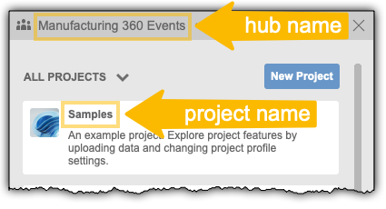
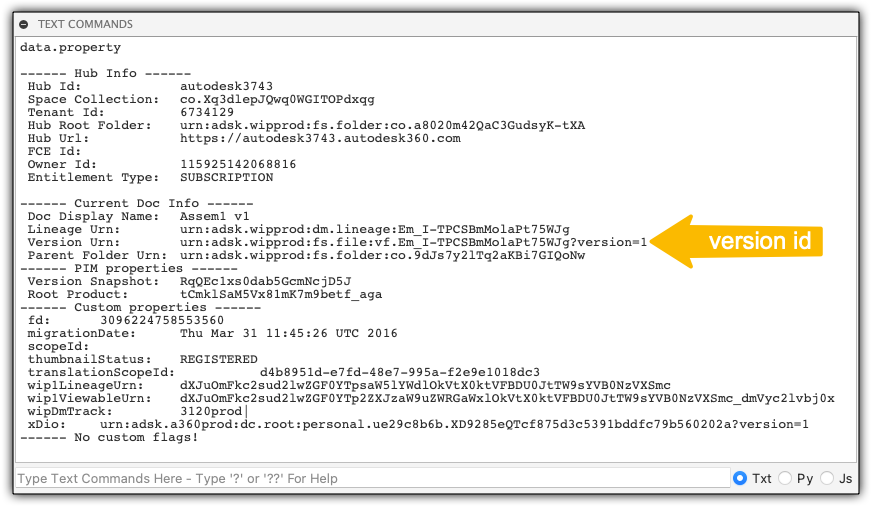

# Read the Complete Model Hierarchy of a Design

## Setting up your test
In the **terminal** run this to install all the necessary components
```
npm i
``` 

You will need to set the value of `clientId` and `clientSecret` variables in `index.js` based on your **Forge app**'s credentials and make sure that the `CallBack URL` of the app is set to `http://localhost:3000/callback/oauth` as shown in the picture\


You will also need to set the value of `hubName`, `projectName` and `versionId` variables. The first two of those you can simply get from e.g. the **Project browser** in **Fusion 360**\
\
And the `versionId` you can get using the `data.property` function in the **'Text Commands'** palette in **Fusion 360**\


## Running the test
In a **terminal**, you can run the test with:
```
npm start
```

## Output
```
Open http://localhost:3000 in a web browser in order to log in with your Autodesk account!
Model hierarchy:
shapes
  Round Things
    Torus
    Sphere
    Cylinder
  Box
  New Box
  cube
```
## Workflow explanation

The workflow can be resumed in 2 steps:

1. Get the root component and its references
2. Keep gathering the references for the child components

-----------

Please refer to this page for more details: [Forge Graph v1](https://forge.autodesk.com/en/docs/forgeag/v1/developers_guide/overview/)
