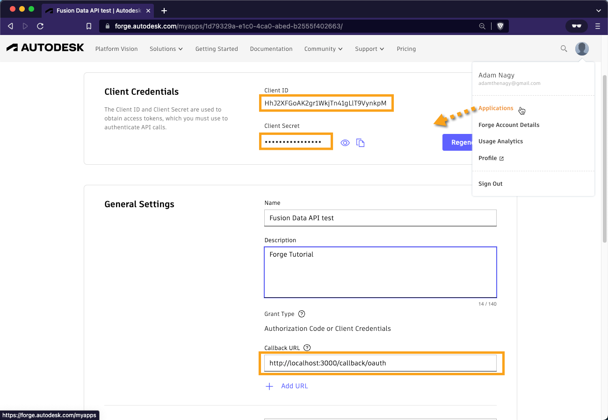
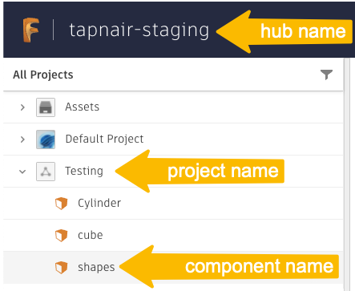

# Read the Complete Model Hierarchy of a Design

## Setting up your test
In the **terminal** run this to install all the necessary components
```
npm i
``` 

You will need to set the value of `clientId` and `clientSecret` variables in `index.js` based on your **Forge app**'s credentials and make sure that the `CallBack URL` of the app is set to `http://localhost:3000/callback/oauth` as shown in the picture\


You will also need to set the value of `hubName`, `projectName` and `fileName` variables. You can find them either in **Fusion Teams** web app, in **Fusion 360** or any other place that lets you navigate the contents of your **Autodesk** hubs and projects - including the **Forge GraphQL API** itself\



## Running the test
In a **terminal**, you can run the test with:
```
npm start
```
As instructed in the console, you'll need to open a web browser and navigate to http://localhost:3000 in order to log into your Autodesk account 

## Output
```
Open http://localhost:3000 in a web browser in order to log in with your Autodesk account!
Model hierarchy:
shapes
  Round Things
    Torus
    Sphere
    Cylinder
  Box
  New Box
  cube
```
## Workflow explanation

The workflow can be achieved following these steps:

1. Get the root component and its references based on the hub, project and file name
3. Keep gathering the references for the child components

-----------

Please refer to this page for more details: [Forge Graph v1](https://forge.autodesk.com/en/docs/forgeag/v1/developers_guide/overview/)
