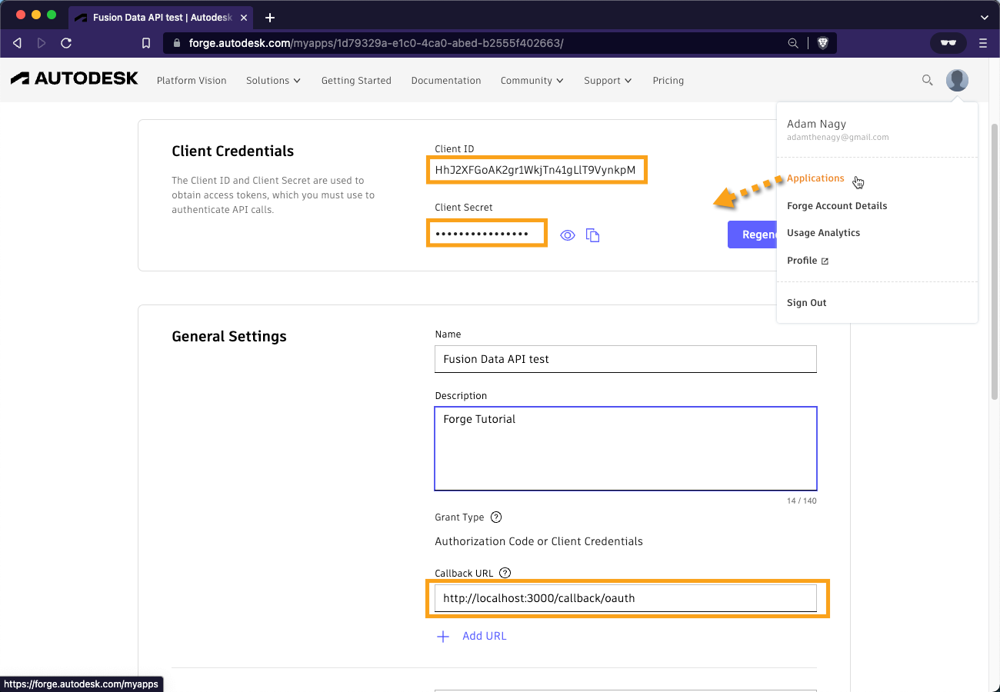
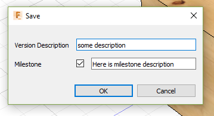
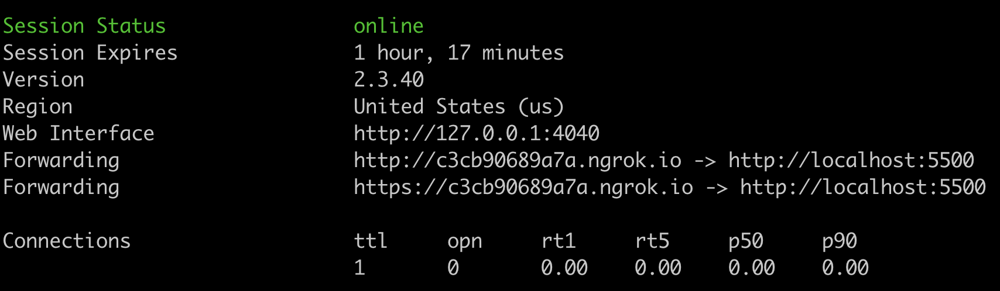

# Know when a Milestone has been created

This sample allows you to subscribe to get notification when a milestone for an Assembly was set.

- [Intro](#intro)

- [Requirements](#requirements)

- [Event subscription workflow](#event-subscription-workflow)

- [Setting up the sample](#setting-up-the-sample)

- [Running Sample](#running-sample)

- [Expected callback data](#expected-callback-data)

## Intro

When a milestone is set for a Fusion360 design, this might require triggering other processes related to the design in
question. To be able to capture and react to such event,
the [Forge Data Evens](https://forge.autodesk.com/en/docs/fevnt/v1/developers_guide/overview/)
allows you to subscribe to different types of entities, but also filter what these entities should include.

This sample illustrates how to subscribe to a Snapshot entity and set
a [filter](https://forge.autodesk.com/en/docs/fevnt/v1/developers_guide/event_filters/) to be notified only
of `milestoneSnapshot` kind.

## Requirements

The following sample requires two things:

1. The **ClientId** and **ClientSecret** \
   For more information on how to create the app, please refer
   to [this tutorial](https://learnforge.autodesk.io/#/account/?id=create-an-app#/account/?id=create-an-app#/account/?id=create-an-app)
   . \
   Upon app creation make sure that the `CallBack URL` of the app is set to `http://localhost:3000/callback/oauth`
   as shown in below picture:

   

2. Install **ngrok** \
   This part of requirements is needed only to be able to run the sample on local machine. \
   To install `ngrok`, please refer to [ngrok documentation](https://ngrok.com/download)

## Event subscription workflow

The workflow can be resumed in 4 steps:

1. Subscribe to `snapshot.created` event and pass the callback url;
2. Monitor the server for any payloads coming to specified callback url;
3. Identify the snapshot that has `milestoneSnapshot` attribute;
4. Get information on all assets contained in identified snapshot.

-----------

### 1. Subscribe to `snapshot.created` event and pass the callback url;

Each time when a new Milestone is created, it triggers creation of a snapshot of
type `"autodesk.product:snapshot-1.0.0"`. The main distinction of a `milestone` type snapshot from `version`or `release`
snapshot is the attribute `name` with value set to `milestoneSnapshot`.

Thus, to subscribe to an event, we can use
the [subscribe to event API](https://forge.autodesk.com/en/docs/fevnt/v1/reference/http/fevnt-subscribe-to-events-POST/)
with the following payload:

```json
{
  "entityUrn": "urn:autodesk.forge.data.assetgraph:collection:{{COLLECTION_ID}}",
  "eventType": "autodesk.forge.data.assetgraph.events:snapshot.created-1.0.0",
  "permissionUrn": "urn:autodesk.forge.data.assetgraph:collection:co.1069EFHgQkyeThLU-h43DA",
  "protocol": "HTTPS",
  "callbackUrl": "{{YOUR_SERVER_ADDRESS}}/callback",
  "filters": [
    "$.data.attributes[?(@.name=='name' && @.value=='milestoneSnapshot')]"
  ],
  "hookAttribute": {
    "type": "This one is with filters!!!"
  }
}
```

where `{{COLLECTION_ID}}` should be replaced with collection id corresponding to your hub and {{YOUR_SERVER_ADDRESS}}
should be replaced with internet address of your server, where you expect to get notifications.

The complete terminal call will look like this

```shell
curl -X POST 'https://developer.api.autodesk.com/fevnt/v1/subscriptions' \
--header 'Authorization: Bearer '$TOKEN \
--header 'Content-Type: application/json' \
--data-raw '{
  "entityUrn": "urn:autodesk.forge.data.assetgraph:collection:'$COLLECTION_ID'",
  "eventType": "autodesk.forge.data.assetgraph.events:snapshot.created-1.0.0",
  "permissionUrn": "urn:autodesk.forge.data.assetgraph:collection:'$COLLECTION_ID'",
  },
  "protocol": "HTTPS",
  "callbackUrl": "'$SERVER_URL'/callback",
  "filters":[
      "$.data.attributes[?(@.name=='\''name'\'' && @.value=='\''milestoneSnapshot'\'')]"
  ],
  "hookAttribute": {
    "type": "This one is with filters!!!"
  }
}'
```

where `$TOKEN`, `$COLLECTION_ID` and `$SERVER_URL` are the appropriate environment variables.

The result of successfully execution of this call will be the result similar to

```json
{
  "subscriptionId": "d67e9fb7-f161-44f1-b427-b72b5823958f"
}
```

where this `subscriptionId` can be used later to review the subscription, as well as delete it , if needed.

### 2. Monitor the server for any payloads coming to specified callback url;

With subscription all set, the server and server path you specified as `callbackUrl` param, should expect a json payload
for each time a milestone is created.

For example, if in Fusion360 we will save the state and check the Milestone checkbox:



After the OK button was pressed, the server will receive a payload similar to this:

```json
 {
   "id": "wTyES4jZyt6oS0mIQqlgSp",
   "source": "urn:autodesk.forge.data.assetgraph:service:snPvAd0o7TBGedxL767Vp1aAiq1hWQoo",
   "specversion": "1.0",
   "type": "autodesk.forge.data.assetgraph.events:snapshot.created-1.0.0",
   "subject": "urn:autodesk.forge.data.assetgraph:snapshot:m8lrjOD1adLqTR8Mafe8Jp",
   "time": "2021-06-16T00:50:39.861Z",
   "data": {
      "commandid": "wTyES4jZyt6oS0mIQqlgSp",
      "collectionurn": "urn:autodesk.forge.data.assetgraph:collection:co.1069EFHgQkyeThLU-h43DA",
      "entitytype": "autodesk.product:snapshot-1.0.0",
      "attributes": [
         {
            "name": "schemasVersion",
            "value": "1.0.0",
            "type": "String",
            "category": "application"
         },
         {
            "name": "name",
            "value": "milestoneSnapshot",
            "type": "String",
            "category": "application"
         },
         {
            "name": "wipVersionUrn",
            "value": "urn:adsk.wipprod:fs.file:vf.kUH9Qi_-R8e1I9ExfEsUkg?version=17",
            "type": "String",
            "category": "application"
         },
         {
            "name": "dmVersionId",
            "value": "urn:adsk.wipprod:fs.file:vf.kUH9Qi_-R8e1I9ExfEsUkg?version=17",
            "type": "String",
            "category": "application"
         }
      ],
      "components": [
         {
            "insert": {
               "autodesk.product:components.milestone-2.0.0": {
                  "milestone": {}
               },
               "autodesk.product:components.snapshot-1.0.0": {
                  "snapshot": {
                     "String": {
                        "createUserId": "EU84MQEGU4YJ",
                        "lastModifiedTime": "2021-06-16T00:50:39.387Z",
                        "createTime": "2021-06-16T00:50:39.387Z",
                        "name": "Here is milestone description",
                        "lastModifiedUserId": "EU84MQEGU4YJ",
                        "description": ""
                     }
                  }
               }
            }
         }
      ]
   },
   "traceparent": "00-3c94067f5a928b9dabd9d159eb7fec0e-cf83adeca170d041-01"
}
```

### 3. Identify the snapshot that has `milestoneSnapshot` attribute;

As mentioned in step 1, a Milestone snapshot has attribute `name` set to value `milestoneSnapshot`. In case we subscribe
to `snapshot.created` event, but omit setting any filters, then for each save, be it `version` or `milestone`, the
callback server will receive notifications and then we will have to filter manually which snapshot is version and which
one is a milestone (if any), by looking at `name` attribute.

In this case we set the filter within our subscription as

```json
"filters":[
"$.data.attributes[?(@.name=='name' && @.value=='milestoneSnapshot')]"
]
```

which indicates that we will be notified only if the criteria in `filters` field is satisfied. In our case it checks if
the payload of the event target (in this case the created snapshot ) has the attribute `name` and that it's value
is `milestoneSnapshot`.

### 4. Get information on all assets contained in identified snapshot.

The payload information received through notification might not be enough to identify the related assembly. In this
case, we will have to get more information on snapshot in question by getting its content and the content of product
assets. In above presented payload, the id of the snapshot can be retrieved from `subject` of the received JSON

```json
 {
    ...
  "subject": "urn:autodesk.forge.data.assetgraph:snapshot:m8lrjOD1adLqTR8Mafe8Jp",
    ...
  }
```

in this case, the snapshot id is `m8lrjOD1adLqTR8Mafe8Jp`.

To retrieve the information on this snapshot, the following call:

```shell
curl 'https://developer.api.autodesk.com/assetgraph/v1/collections/'$COLLECTION_ID'/snapshots/m8lrjOD1adLqTR8Mafe8Jp' \
--header 'Authorization: Bearer '$TOKEN
```

which will provide a result similar to the following:

```json
{
  "type": "autodesk.product:snapshot-1.0.0",
  "snapshot": {
    "id": "m8lrjOD1adLqTR8Mafe8Jp",
    "url": "/collections/co.1069EFHgQkyeThLU-h43DA/snapshots/m8lrjOD1adLqTR8Mafe8Jp",
    "type": "autodesk.product:snapshot-1.0.0"
  },
  ...
  "assets": {
    "id": "m8lrjOD1adLqTR8Mafe8Jp",
    "url": "/collections/co.1069EFHgQkyeThLU-h43DA/snapshots/m8lrjOD1adLqTR8Mafe8Jp/assets",
    "data": [
      {
        "asset": {
          "id": "JUGLhe6CtJLvd3Ak5Ip48D_aga",
          "url": "/collections/co.1069EFHgQkyeThLU-h43DA/assets/JUGLhe6CtJLvd3Ak5Ip48D_aga",
          "type": "autodesk.product:assets.design-6.0.0"
        },
        "revision": {
          "id": "XWoncTokK0MlTPR7pHWmSP",
          "url": "/collections/co.1069EFHgQkyeThLU-h43DA/commands/XWoncTokK0MlTPR7pHWmSP"
        }
      },
      {
        "asset": {
          "id": "IFGNPyMxGNT1tN4dp7QOH3_aga",
          "url": "/collections/co.1069EFHgQkyeThLU-h43DA/assets/IFGNPyMxGNT1tN4dp7QOH3_aga",
          "type": "autodesk.product:assets.product-4.0.0"
        },
        "revision": {
          "id": "8OmBhieG8ZLwrKqLjxHDr3",
          "url": "/collections/co.1069EFHgQkyeThLU-h43DA/commands/8OmBhieG8ZLwrKqLjxHDr3"
        }
      },
      {
        "asset": {
          "id": "7cafsJGjEN6UI3XGfsyBzb_aga",
          "url": "/collections/co.1069EFHgQkyeThLU-h43DA/assets/7cafsJGjEN6UI3XGfsyBzb_aga",
          "type": "autodesk.product:assets.model-2.0.0"
        },
        "revision": {
          "id": "6jHWBTgae9eFNlyqilyrUL",
          "url": "/collections/co.1069EFHgQkyeThLU-h43DA/commands/6jHWBTgae9eFNlyqilyrUL"
        }
      }
    ]
  },
  ...
}

```

from which we are interested only in assets of type `autodesk.product:assets.product-4.0.0`, in thi s case, the asset
with id `IFGNPyMxGNT1tN4dp7QOH3_aga`.

The information on this asset will provide us with information on the assembly and can be retrieved using following
call:

```shell
curl 'https://developer.api.autodesk.com/assetgraph/v1/collections/'$COLLECTION_ID'/assets/IFGNPyMxGNT1tN4dp7QOH3_aga' \
--header 'Authorization: Bearer '$TOKEN
```

which will provide information similar to the following:

```json
{
  "type": "autodesk.product:assets.product-4.0.0",
  "id": "IFGNPyMxGNT1tN4dp7QOH3_aga",
  ...
  "components": {
    "id": "IFGNPyMxGNT1tN4dp7QOH3_aga",
    "url": "/collections/co.1069EFHgQkyeThLU-h43DA/assets/IFGNPyMxGNT1tN4dp7QOH3_aga/components",
    "data": {
      "insert": {
        "autodesk.product:components.partNumber-2.1.0": {
          "partNumber": {
            "String": {
              "description": "",
              "partNumber": "Steering Wheel Assembly",
              "partName": "Steering Wheel Assembly"
            }
          }
        }
      }
    }
  },
  ...
}
```

where the important information is the `partNumber`.

Please refer to this page for more
details: [Forge Graph v1](https://forge.autodesk.com/en/docs/forgeag/v1/developers_guide/overview/)

## Setting up the sample

To install all necessary dependencies, using **terminal** inside sample folder, run the following command:

```
npm install
``` 

Inside index.js file, you will have to set four things:


To get the value of `collectionId` variable, check the steps described in
[Requirements](##Requirements) section of this README.

To get `<YOUR_NGROK_URL>` you have to start `ngrok` with this line in the terminal:

```shell
ngrok http 5500 -host-header="localhost:5500"
```

which will provide you with information similar to:



the info in `Forwarding` section contains the `ngrok url`, in this case we would use the `http://c3cb90689a7a.ngrok.io`
part to replace the `<YOUR_NGROK_URL>` string in `index.js` file.

## Running Sample

To run the sample, using **terminal** inside sample folder, run the following command:

```shell
npm start
```

Since (at least for the moment), the Forge Data Events APi requires 3-legged authentication token, we have to authorise
this app by opening the page `http://localhost:3000` in a browser and log in with your **Autodesk**
credentials.

This will generate the necessary **3-legged access token** the application needs and in **terminal**, as app output you
will see information similar to:

```shell
Subscribing to snapshot.created event on collection corresponding to hub "Grigor_Team"
        Subscribed using filter: $.data.attributes[?(@.name=='name' && @.value=='milestoneSnapshot')] 
        => SubscriptionId: { subscriptionId: 'fdafbd3b-4060-4a69-80a9-009a05c54a21' }

Subscribing to snapshot.created event on collection corresponding to hub "Dream Team"
        Subscribed using filter: $.data.attributes[?(@.name=='name' && @.value=='milestoneSnapshot')] 
        => SubscriptionId: { subscriptionId: '277a85aa-fb4d-4df4-99ad-93ebbdbb1503' }
Listening to the events on http://localhost:5500 => http://9c07-166-48-222-18.ngrok.io/callback

Create in Fusion360 a milestone and expect an event here:


```

## Expected callback data

Once you create a new milestone snapshot in **Fusion 360**, you'll get a message like this one in the terminal:

```
New milestone "Ready for review pipeline" was created for Steering Wheel Assembly
```


