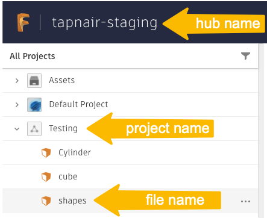
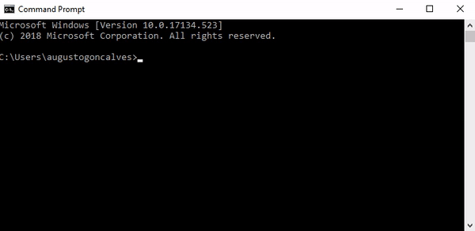

# Know When a New Milestone is Available

## Setting up your test
In the **terminal** run this to install all the necessary components
```
npm i
``` 

You will need to set the value of `clientId` and `clientSecret` variables in `index.js` based on your **Forge app**'s credentials and make sure that the `CallBack URL` of the app is set to `http://localhost:3000/callback/oauth` as shown in the picture\


You will also need to set the value of `hubName`, `projectName` and `fileName` variables. You can find them either in **Fusion Teams** web app, in **Fusion 360** or any other place that lets you navigate the contents of your **Autodesk** hubs and projects - including the **Forge GraphQL API** itself\


Then start **ngrok** that will provide a publicly available URL that the **Forge** webhook can send messages to, which then will be passed to your computer\


As shown in the gif, you need to copy the relevant URL and set the value of `ngrokUrl` in `index.js` to that 

## Running the test
In a **terminal**, you can run the test with:
```
npm start
```
As instructed in the console, you'll need to open a web browser and navigate to http://localhost:3000 in order to log into your Autodesk account 

## Output
```
Open http://localhost:3000 in a web browser in order to log in with your Autodesk account!
Deleted webhook ccec121a-d496-4ff9-adf5-84446695e041
Created webhook e862d1b7-44d6-4268-a96c-8072978fb472
Listening to the events on http://localhost:3000 => http://cf7e-86-2-185-49.ngrok.io/callback

Create a milestone in Fusion 360 and wait for the event to be listed here:
```
Here is how you can  create a milestone in **Fusion 360**\


## Workflow explanation

The workflow can be achieved following these steps:

1. Get the id of root component 
2. Subscribe to the MILESTONE_CREATED event on the specific component
3. Listen to the event

## PIM API Query

In `app.js` file, the following GraphQL query creates the webhook that will notify you when a new milstone gets created

```
mutation CreateWebhook($componentId: ID!, $eventType: WebhookEventTypeEnum!, $callbackURL: String!) {
  createWebhook(webhook: {
    componentId: $componentId,
    eventType: $eventType,
    callbackURL: $callbackURL,
    expiresOn: "2022-10-12T07:20:50.52Z",
    secretToken: "12345678901234567890123456789012"
  }) {
    id
  }
}
```


-----------

Please refer to this page for more details: [PIM API GraphQL Docs](https://forge.autodesk.com/en/docs/pim-graphql/v1/developers_guide/overview/)

