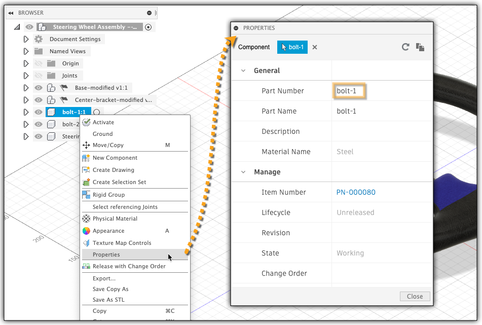
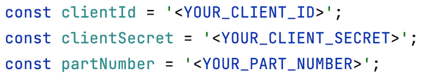
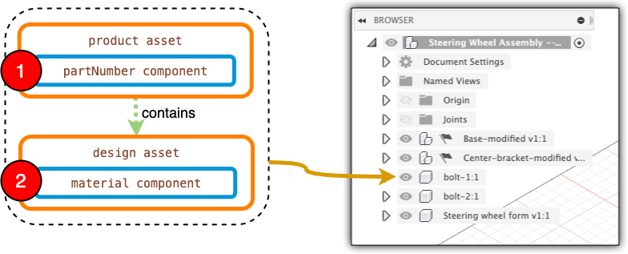

# Find the Thumbnail of a specific Part

This sample allows you to get the material of a part, by providing its part number.

- [Intro](#intro)

- [Requirements](#requirements)

- [Workflow explanation](#workflow-explanation)

- [Setting up the sample](#setting-up-the-sample)

- [Running Sample](#running-sample)


## Intro

This sample illustrates the step of getting the material of a part, having its Part Number.
This step might be needed when there is a need of getting the material for different parts in different assemblies and 
use it to aggregate and group parts by materials.

## Requirements

This sample requires the following things:

1. The **ClientId** and **ClientSecret** \
   For more information on how to create the app, please refer
   to [this tutorial](https://learnforge.autodesk.io/#/account/?id=create-an-app#/account/?id=create-an-app#/account/?id=create-an-app). \
   Upon app creation make sure that the `CallBack URL` of the app is set to `http://localhost:3000/callback/oauth`
   as shown in below picture:

   

2. The **partNumber** \
   The **part number** whose material you want to check could be already present in your system (as part of BOM), or you could retrieve 
   using the **'Properties'** palette
   in **Fusion 360** and set the value of `partNumber` variable to that 


The above mentioned requirements has to be set within `index.js`:



***Note:*** Here the values for `partNumber` and `collectionId` vars are presented as illustration.


## Workflow explanation



The workflow can be resumed in 5 steps:

1. Get all assets containing `partNumber` component;
2. Identify the asset containing the needed part number;
3. Through relationships query, identify all related assets;
4. Within identified related assets, isolate the one containing `autodesk.product:components.material-1.0.0` component;
5. Get the value of the material from the asset identified in previous step.

-----------

### 1. Get all assets containing `partNumber` component;
The part number is contained in assets having an `autodesk.product:components.partNumber-2.1.0` component.

To retrieve all assets with such component, when requesting all assets, we can pass a filter as parameter with
following content: `filter=has.component.type=='autodesk.product:components.partNumber-2.1.0'`

In this case the full call would look like:

```shell
curl 'https://developer.api.autodesk.com/assetgraph/v1/collections/'$COLLECTION_ID'/assets?filter=has.component.type=="autodesk.product:components.partNumber-2.1.0"' \
--header 'Authorization: Bearer '$TOKEN
```

Where $TOKEN and $COLLECTION_ID are environment variable.

At this stage, the response will be a paginated list of assets, containing the part number, as in bellow extract:

```json

{
  "type": "autodesk.product:assets.product-4.0.0",
  "id": "MHDQpjySpcn0bcB1sF3CLx_aga",
  ...
  "components": {
    "id": "MHDQpjySpcn0bcB1sF3CLx_aga",
    "url": "/collections/co.1069EFHgQkyeThLU-h43DA/assets/MHDQpjySpcn0bcB1sF3CLx_aga/components",
    "data": {
      "insert": {
        "autodesk.product:components.partNumber-2.1.0": {
          "partNumber": {
            "String": {
              "description": "",
              "partNumber": "31-Low Friction Ring",
              "partName": "31-Low Friction Ring"
    }}}}}},
  ...
}
```

### 2. Identify the asset containing the needed part number

At this moment, to identify the asset containing the needed part number,
we have to retrieve all assets containing this type of data (as illustrated above)
and isolate the one containing the needed `partNumber` value.


### 3. Through relationships query, identify all related assets


The id of the asset that has been identified, will be used to retrieve all relationships this asset has, using the
filter `filter=fromAsset==<ASSET_ID>`.

In this case the full call would look like:

```shell
curl 'https://developer.api.autodesk.com/assetgraph/v1/collections/'$COLLECTION_ID'/relationships?filter=fromAsset==MHDQpjySpcn0bcB1sF3CLx_aga' \
--header 'Authorization: Bearer '$TOKEN
```
The result of this request will contain the reference to another asset:

```json
  {
  "id": "qyl6i4WGP4nw2X8NCEPsXN",
  "type": "autodesk.product:relationship.contains-2.0.0",
  "from": {
    "asset": {
      "id": "MHDQpjySpcn0bcB1sF3CLx_aga",
      "url": "/collections/co.1069EFHgQkyeThLU-h43DA/assets/MHDQpjySpcn0bcB1sF3CLx_aga"
    }
  },
  "to": {
    "asset": {
      "id": "Qd2rvQuo0TPQ4FYBw2MgnD_aga",
      "url": "/collections/co.1069EFHgQkyeThLU-h43DA/assets/Qd2rvQuo0TPQ4FYBw2MgnD_aga"
    }
  },
  ...
}
```

### 4. Within identified related assets, isolate the one containing `autodesk.product:components.material-1.0.0` component;

From this result, we are interested in `id` of the asset, this relation points to, in this case `Qd2rvQuo0TPQ4FYBw2MgnD_aga`.
Having this asset id, we can retrieve this asset, by calling:

```shell
curl GET 'https://developer.api.autodesk.com/assetgraph/v1/collections/'$COLLECTION_ID'/assets/Qd2rvQuo0TPQ4FYBw2MgnD_aga' \
--header 'Authorization: Bearer '$TOKEN
```
Which gives us the asset content, including the information on material:

```json
{
  "type": "autodesk.product:assets.design-6.0.0",
  "id": "Qd2rvQuo0TPQ4FYBw2MgnD_aga",
  ...
  "components": {
    "id": "Qd2rvQuo0TPQ4FYBw2MgnD_aga",
    "url": "/collections/co.1069EFHgQkyeThLU-h43DA/assets/Qd2rvQuo0TPQ4FYBw2MgnD_aga/components",
    "data": {
      "insert": {
        "autodesk.product:components.material-1.0.0": {
          "material": {
            "String": {
              "name": "Polytetrafluoroethylene"
            }
          }
        }
      }
    }
  },
 ...
}
```

### 5. Get the value of the material from the asset identified in previous step.

Make sure that the related assets contains `autodesk.product:components.material-1.0.0` component.
Within this component, it holds the name of the material, in this case `Polytetrafluoroethylene`.

Thus, in the end we found that Part `31-Low Friction Ring` has `Polytetrafluoroethylene` material.


## Setting up the sample

To install all necessary dependencies, using **terminal** inside sample folder, run the following command:

```shell
npm install
```


## Running Sample

To run the sample, using **terminal** inside sample folder, run the following command:

```shell
npm start
```

First you'll get a message in the terminal, asking you yo open page
`http://localhost:3000` in a browser in order to log in with
your **Autodesk** credentials -
this will generate the necessary **3-legged access token** the application needs.

Then you will get the material information for provided part number:

```shell
Checking for part in collection with id = co.-9xmGPGLQM2M3Hlk37LXwQ [associated with hub "Grigor_Team"] ...
Part Number "Steering wheel form v1" was not found in this collection.

Checking for part in collection with id = co.3009EFHgQkyeThLU-ABCD [associated with hub "Dream Team"] ...
Material of part with Part Number "Steering wheel form v1" is "Aluminum 2014-T6"


```


Please refer to this page for more details: [Forge Graph v1](https://forge.autodesk.com/en/docs/forgeag/v1/developers_guide/overview/)


