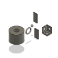

# Find the Thumbnail of a specific Part

## Setting up your test
In the **terminal** run this to install all the necessary components
```
npm i
``` 

You will need to set the value of `clientId` and `clientSecret` variables in `index.js` based on your **Forge app**'s credentials and make sure that the `Callback URL` of the app is set to `http://localhost:3000/callback/oauth` as shown in the picture\


You will also need to set the value of `hubName`, `projectName` and `componentName` variables. You can find them either in **Fusion Teams** web app, in **Fusion 360** or any other place that lets you navigate the contents of your **Autodesk** hubs and projects - including the **Fusion Data API** itself\


## Running the test
In a **terminal**, you can run the test with:
```
npm start
```
As instructed in the console, you'll need to open a web browser and navigate to http://localhost:3000 in order to log into your Autodesk account 

## Output
```
Open http://localhost:3000 in a web browser in order to log in with your Autodesk account!
Open thumbnail from location: file:///Users/nagyad/Documents/GitHub/Autodesk-Forge/PIM_Workflows_GraphQL/3.Find%20the%20Thumbnail%20of%20a%20specific%20Part/thumbnail.png
```
Once the thumbnail has been downloaded, a link will be provided to it in the console that you can click - e.g.:\


## Workflow explanation

The workflow can be achieved following these steps:

1. Ask for the thumbnail of a specific model based on its hub, project and component name
2. If it's not available yet (status is "pending") then keep checking the latest status
3. Once the status is "success" you can download the thumbnail using the url provided

## Fusion Data API Query

In `app.js` file, the following GraphQL query traverses the hub, project and its rootfolder to find the design to generate the thumbnail for
```
query GetThumbnail($hubName: String!, $projectName: String!, $componentName: String!) {
  hubs(filter:{name:$hubName}) {
    results {
      projects(filter:{name:$projectName}) {
        results {
          rootFolder {
            items(filter:{name:$componentName}) {
              results {
                ... on Component {
                  tipVersion {
                    thumbnail {
                      status
                      mediumImageUrl
                    }          
                  }
                }
              }
            }
          }
        }
      }
    }
  }
}
```


-----------

Please refer to this page for more details: [Fusion Data API Docs](https://forge.autodesk.com/en/docs/fusiondata/v1/developers_guide/overview/)