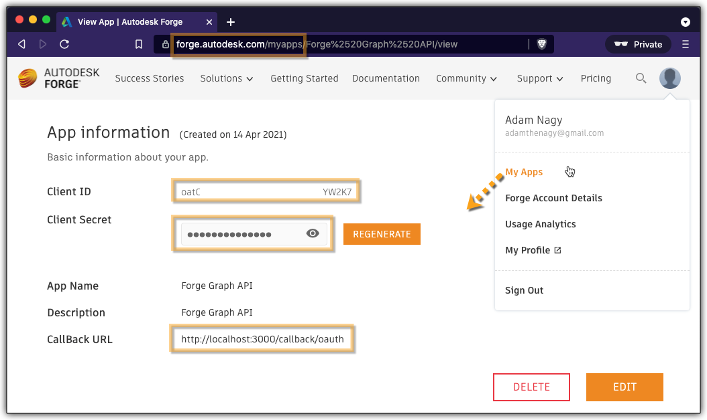
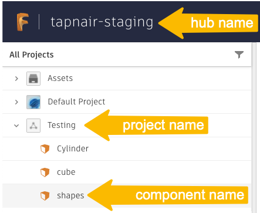

# Work With Properties

## Setting up your test
In the **terminal** run this to install all the necessary components
```
npm i
``` 

You will need to set the value of `clientId` and `clientSecret` variables in `index.js` based on your **Forge app**'s credentials and make sure that the `CallBack URL` of the app is set to `http://localhost:3000/callback/oauth` as shown in the picture\


You will also need to set the value of `hubName`, `projectName`, `componentName` variables to identify the design you want to work with, the `propertyGroupName`, `properties` and `operation` variables to specify what you want to do with your custom properties. 
You can find the exact values to use for `hubName`, `projectName`, `componentName` variables by finding your design either in **Fusion Teams** web app, in **Fusion 360** or any other place that lets you navigate the contents of your **Autodesk** hubs and projects - including the **Fusion Data API** itself\



## Running the test
In a **terminal**, you can run the test with:
```
npm start
```
As instructed in the console, you'll need to open a web browser and navigate to http://localhost:3000 in order to log into your Autodesk account 

## Output
Depending on what properties you have already added to the model and which operation you are using (create vs uppdate vs delete) the output will be different. Let's say we have properties added to the model alraed and we want to delete them, then we would have something like this in the terminal
```
Open http://localhost:3000 in a web browser in order to log in with your Autodesk account!
Current properties for componentVersion with id Y29tcH5jby5Gc3E1VDNfcFRreVV5aWI0R180THp3fjh0RTJtS3lJRjFBcnlhTHYwc1IzWVdfYWdhfkQycXRkUlNTUnVLUEE5ZWxEZXM1Y2U in the com.test property group
{
  "id": "ZXh0fmNvLkZzcTVUM19wVGt5VXlpYjRHXzRMend+aTU3RXNuWTYxaXI3WWdWelRnU2pETl9hZ2E=",
  "name": "com.test",
  "properties": [
    {
      "name": "countBodies",
      "displayValue": "true"
    },
    {
      "name": "partNumber",
      "displayValue": "MyPartNumber"
    }
  ]
}
Deleted property 'partNumber'
Deleted property 'countBodies'
```

## Workflow explanation

The workflow can be achieved following these steps:

1. Find the component version of a specific model based on its hub, project and component name
2. Add properties to the model 
3. Access existing properties 
4. Update exising properties 
5. Delete properties if not needed anymore

## Fusion Data API Query

In `app.js` file, the following GraphQL query traverses the hub, project and its rootfolder to find the design to work with
```
query GetThumbnail($hubName: String!, $projectName: String!, $componentName: String!) {
  hubs(filter:{name:$hubName}) {
    results {
      projects(filter:{name:$projectName}) {
        results {
          rootFolder {
            items(filter:{name:$componentName}) {
              results {
                ... on Component {
                  tipVersion {
                    id      
                  }
                }
              }
            }
          }
        }
      }
    }
  }
}
```

If your property group does not exist yet, then can create it using this mutation:
```
mutation CreatePropertyGroup($componentVersionId: ID!, $propertyGroupName: String!) {
  createPropertyGroup(input: {extendableID: $componentVersionId, name: $propertyGroupName}) {
    propertyGroup {
      id
    }
  }
}
```

Then add properties to it using this mutation:
```
mutation CreateProperty($propertyGroupId: ID!, $name: String!, $value: ${property.type}!) {
  create${property.type}Property(input: {propertyGroupId: $propertyGroupId, name: $name, value: $value}) {
    property {
      name
    }
  }
}
```

If you need to update their values you can do it llike this:
```
mutation UpdateProperty($propertyGroupId: ID!, $name: String!, $value: ${property.type}!) {
        update${property.type}Property(input: {propertyGroupId: $propertyGroupId, name: $name, value: $value}) {
          property {
            name
          }
        }
      }
```

If you don't need the properties anymore you can also delete them:
```
mutation DeleteProperty($propertyGroupId: ID!) {
  deletePropertyGroup(input: {propertyGroupId: $propertyGroupId}) {
    id
  }
}
```

-----------

Please refer to this page for more details: [Fusion Data API Docs](https://forge.autodesk.com/en/docs/fusiondata/v1/developers_guide/overview/)