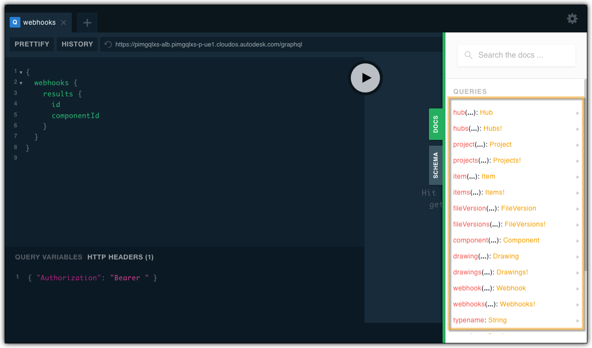
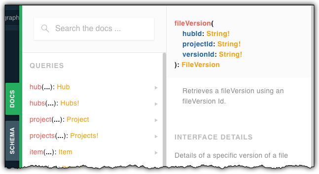

# PIM Workflows using GraphQL


[](http://opensource.org/licenses/MIT)


**Forge API:** [](http://developer-autodesk.github.io/)
[](https://forge.autodesk.com/en/docs/forgeag/v1/developers_guide/overview/)
[](https://forge.autodesk.com/en/docs/fevnt/v1/developers_guide/overview/)

---

This repository contains several samples illustrating use of Forge GraphQL API in context of PIM workflow:

1. [Read the Complete Model Hierarchy of a Design](./1.Read%20the%20Complete%20Model%20Hierarchy%20of%20a%20Design) 

   -  based on the **path to a model** (hub name, project name and file name) you can get the full model hierarchy - similar to what is shown inside **Fusion 360**.


2. [Know when a Milestone is Available](./2.Know%20When%20a%20New%20Milestone%20is%20Available)
	
   - subscribe to the `milestone.created` event of a specific model in order to be notified when a milestone is created for a given version of it.


3. [Find the Thumbnail of a specific Part](./3.Find%20the%20Thumbnail%20of%20a%20specific%20Part)
   
	-  based on the **path to a model** (hub name, project name and file name) you can get the thumbnail of a given model.

---

## Prerequisites
1. **Forge Account**: Learn how to create a Forge Account, activate subscription and create an app at [this tutorial](http://learnforge.autodesk.io/#/account/);
2. [Node.Js](https://nodejs.org) with version > v16.13.2 and basic knowledge of JavaScript;


## Notes

Though the samples start with the `hubs(){}` query, there are many other options for you. The easiest is to check the **QUERIES** section on the **DOCS** tab in the [PIM GraphQL Explorer](https://forge.autodesk.com/en/docs/pim-graphql/v1/playground/pim-graphql-explorer/) to see what other starting points are available.



As you can see, you could e.g. start directly with a given file version if you already know the parameters it requires: `hubId`, `projectId` and `versionId`. Perhaps you already have the necessary values from a previous **GraphQL** request or via the [Data Management API](https://forge.autodesk.com/en/docs/data/v2/developers_guide/overview/) 



In that case the query might look like this:

```
{
  fileVersion(
    hubId: "a.YnVzaW5lc3M6YXV0b2Rlc2s2MTA0",
    projectId: "a.YnVzaW5lc3M6YXV0b2Rlc2s2MTA0IzIwMjIwMjA0NDkzNjczNjA2",
    versionId: "urn:adsk.wipprod:fs.file:vf.0pdKmY_sTHW957H5fthyLw?version=5"
  ) {
    ... on DesignFileVersion {
      id
      rootComponent {
        name
      }
    }
  }
}
```
and the reply could be:
```
{
  "data": {
    "fileVersion": {
      "id": "urn:adsk.wipprod:fs.file:vf.0pdKmY_sTHW957H5fthyLw?version=5",
      "rootComponent": {
        "name": "Box"
      }
    }
  }
}
```

# License

These samples are licensed under the terms of the [MIT License](http://opensource.org/licenses/MIT). Please see the [LICENSE](LICENSE) file for full details.

# Written by

Adam Nagy [adam.nagy@autodesk.com](adam.nagy@autodesk.com), [Forge Partner Development](http://forge.autodesk.com)

Denis Grigor [denis.grigor@autodesk.com](denis.grigor@autodesk.com), [Forge Partner Development](http://forge.autodesk.com)
